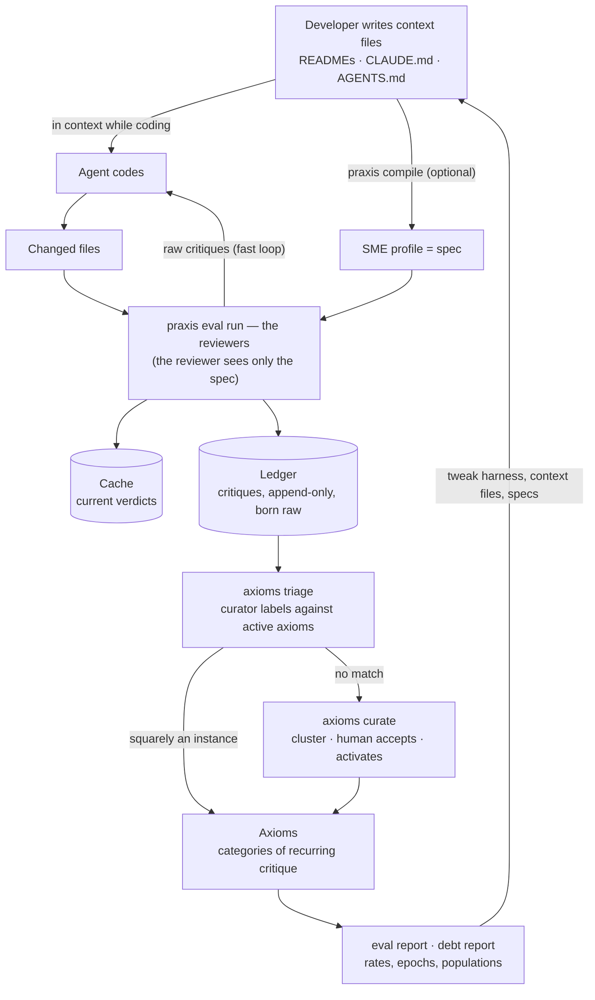

# Praxis — Design Specs

The design record of Praxis v2 (**shipped 2026-09-10 as v2.0.0**) and the working documents for what comes next. These began as drafts for argument; the argument happened, the decisions landed in the implementation, and each document now records its design *with the dates and reasons decisions were made*. A spec that lags the code is a bug: implementation decisions are written back here in the same change.

## The thesis

Agentic eval today works on the two tractable cases: benchmarks (known answer) and agentic product flows (known outcome). Agentic _development_ has neither — "build me X" produces traces too long to review and outputs too subjective to score. Most teams settle for an adversarial reviewer agent with no grounding.

Praxis substitutes a tractable question for an intractable one:

> Not "is this code good?" — but "does this satisfy the standard we wrote down?"

The eval signal is company-specific by construction, which is also why nobody else can build it for you.

And the specs are not a new artifact Praxis asks anyone to write. They are the developer's _existing_ context files — READMEs, CLAUDE.md, AGENTS.md, whatever carries direction — the same material the agent has in context while it codes, optionally compiled into an SME profile that is itself the spec. That double duty is what makes this an eval rather than a review: **the reviewer measures adherence to the exact direction the agent was given.** A violation is never "the agent didn't know" — it is "the context didn't carry it," which is precisely a harness signal.

## The cycle

Two loops share the machinery: the **fast loop** — verdicts and raw critiques feed straight back to the agent during live coding (labels never enter the review; they appear in reports after triage) — and the **slow loop** — critiques accumulate in the ledger, triage labels them under the active taxonomy, curation grows the taxonomy from the unmatched residue with a human accepting every addition, and quantification turns categories into the evidence that drives harness, context, and spec changes.

## Documents

| Doc                                                                     | Covers                                                                                          | Status                                             |
| ----------------------------------------------------------------------- | ------------------------------------------------------------------------------------------------ | --------------------------------------------------- |
| [vocabulary.md](./vocabulary.md)                                        | Precise definitions everything else depends on                                                   | Shipped; maintained                                 |
| [01-populations-and-eval-unit.md](./01-populations-and-eval-unit.md)    | Three populations of code; eval units; corpus honesty                                            | Shipped (diff units withdrawn to roadmap)           |
| [02-baselines-and-debt-paydown.md](./02-baselines-and-debt-paydown.md)  | Debt baselines, paydown, epochs and hard breaks                                                  | Shipped                                             |
| [03-judgment-boundary.md](./03-judgment-boundary.md)                    | Don't use Praxis for what static linting can do; the boundary held at drafting time              | Shipped                                             |
| [04-axioms.md](./04-axioms.md)                                          | Axioms as categories of recurring critique; review→label; curation; lifecycle                    | Shipped (rewritten 2026-09-07, reframed 2026-09-10) |
| [05-ledger.md](./05-ledger.md)                                          | Append-only critique store; provenance; why the cache can't be it                                | Shipped                                             |
| [07-metrics.md](./07-metrics.md)                                        | Hard reporting rules; report surfaces                                                            | Shipped                                             |
| [09-cli-surface.md](./09-cli-surface.md)                                | Fully CLI-driven; agents as first-class CLI users; display and interaction                       | Shipped                                             |
| [10-workspace.md](./10-workspace.md)                                    | `.praxis/` layout: closed top level, ownership split, commit policy                              | Shipped                                             |
| [11-spec-layer.md](./11-spec-layer.md)                                  | Two layers: taxonomy-free eval core; compiler tools as optional spec authoring                   | Shipped                                             |
| [13-roadmap.md](./13-roadmap.md)                                        | The build order as it happened, and the roadmap ideas                                            | Record                                              |
| [roadmap/](./roadmap/)                                                  | Withdrawn designs — calibration, harness feedback, git/diff integration — kept for revisiting    | Roadmap                                             |
| [EXECUTION.md](./EXECUTION.md)                                          | The buildable rows and their outcomes, milestone by milestone                                    | Record                                              |

Read `vocabulary.md` first. Several terms in common use here (spec, reviewer, conformance, coverage) are used more narrowly than their everyday senses, and the distinctions carry weight.

Numbering note: 06 (calibration), 08 (harness feedback), and 12 (git integration) shipped, were withdrawn in the 2026-09-07 core simplification, and live in [roadmap/](./roadmap/); the gaps in the numbering are deliberate history.

## Cross-cutting principles

Every document below is bound by these. If a design violates one, the design changes.

**Coverage and conformance are always reported together.** Specs are self-authored. The cheapest way to improve any conformance number is to soften the spec or narrow a `paths:` glob — both invisible in a conformance chart alone. Never print one without the other.

**Violations per applicable opportunity, never raw counts.** Raw counts conflate three different things: categories that are genuinely hard, categories that are simply applicable more often, and categories drawn vaguely enough that the reviewer over-triggers. A vague category is indistinguishable from an agent failure in count data, which points remediation at the wrong end of the loop.

**Drift detection over improvement attribution.** In a real organization the model, the skills, the codebase, and human prompting all change simultaneously. "Conformance dropped 8% after this harness change" is defensible. "Our agents are 12% better this quarter" will not survive a sharp question about how agent improvement was separated from reviewer drift — and there is no good answer.

**Prevent reviewer error structurally where it can be prevented.** An exclusion stated in prose is an instruction the reviewer must notice and obey. An exclusion stated in frontmatter is a file the reviewer never sees.

**Don't use Praxis for what static linting can accomplish.** If you can write the check, write the check; if you can only describe the standard, write the spec. The boundary is held at drafting time (the curator's prompt and the human who accepts), keeps the reviewer-error surface minimal, and keeps the metrics about violations that actually accumulate — judgment violations merge; linter violations don't.

**The reviewer sees only the spec.** Axioms are a taxonomy over evidence, never review input — injection is redundant where traceability holds, breaks the judge/worker symmetry, measurably contaminates the instrument, and makes ratification a second source of truth (the four grounds, 2026-09-06). The reviewer's context contains exactly what the spec declares: the target, its `context:` assists, or the declared cohort. Less is myopia; more is contamination and cache destruction.

**The eval layer is taxonomy-free.** Praxis is two layers: the eval layer (spec, scope, reviewer, ledger, axioms, metrics) and the spec layer, where the compiler tools and the content taxonomy (experts, practices, constitution, conventions) live as an optional authoring discipline. The eval layer's input contract is a spec, a scope, and hashable content — nothing in it may depend on how the spec was authored. See [11](./11-spec-layer.md).

**The CLI is the only interface, and agents are first-class users of it.** Agents check axioms, review files, and read reports by running `praxis` — never through per-harness tools or skills, which would mean a second surface that drifts. Help text is the API documentation, `--json` output is a stable contract, exit codes carry meaning, stdout stays parseable. Harness packages, where they exist, are documentation of CLI usage, never an alternative interface. See [09](./09-cli-surface.md).

**Praxis is single-repo tooling.** Every mechanism here — specs, ledger, axioms, epochs — is scoped to one repository. Multi-repo aggregation and org-level axiom sharing are future considerations, deliberately out of scope.

**Verdict provenance is mandatory.** A stored verdict that does not record the reviewer, the spec content hash, and the relevant config cannot be interpreted later. Provenance is not metadata; it is what makes the number mean anything.

## What grounded this

The original hypothesis source was one working instance (`zarpay/core`: a single SME covering 26 files, 223 critiques) — one datapoint, used for illustration and never as a design target. Its most useful product was a disconfirmation: the reviewed files predated their spec by a month, so the failures were inherited debt, not a signal about agents — the observation [01](./01-populations-and-eval-unit.md) is built on.

Development itself then became the evidence: the `demo/` project (Scoop Society) is the standing acceptance test — every milestone ends in a live role-play against real reviewers, and its committed ledger is the history of the design working — and live adoption in a second real project surfaced the instrument-contamination measurement that produced the review→label redesign (2026-09-06).
