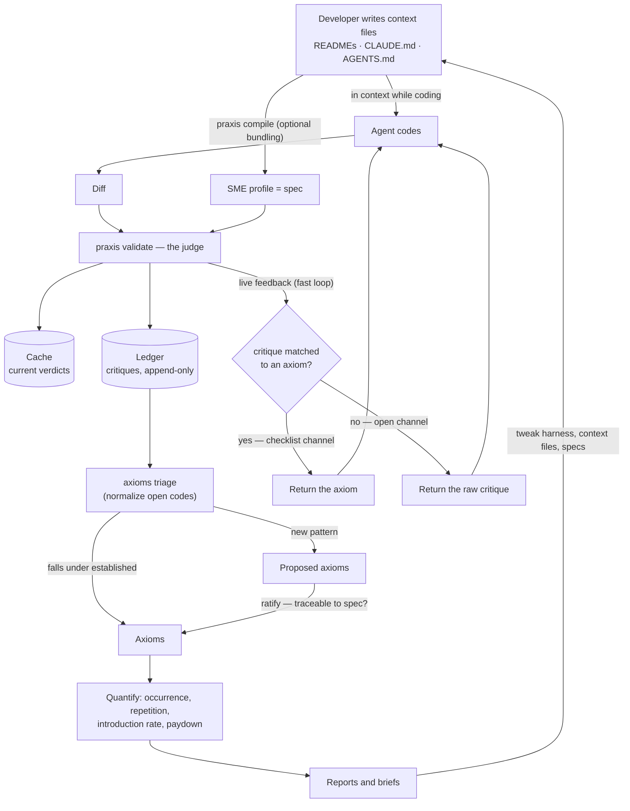

# Praxis v2 — Agentic Development Eval

Working specs for evolving Praxis from a conceptual linter into an eval instrument for agentic development.

These are **drafts for argument**, not decisions. They are deliberately opinionated so there is something to push against. Where a claim rests on a single observation, it is labelled as a hypothesis rather than smuggled in as a premise.

## The thesis

Agentic eval today works on the two tractable cases: benchmarks (known answer) and agentic product flows (known outcome). Agentic *development* has neither — "build me X" produces traces too long to review and outputs too subjective to score. Most teams settle for an adversarial reviewer agent with no grounding.

Praxis holds the missing primitive. SME profiles compile from an organization's own codified standards, and `validates:` makes the compiled profile *be* the spec. That substitutes a tractable question for an intractable one:

> Not "is this code good?" — but "does this satisfy the standard we wrote down?"

The eval signal is company-specific by construction, which is also why nobody else can build it for you.

And the specs are not a new artifact Praxis asks anyone to write. They are the developer's *existing* context files — READMEs, CLAUDE.md, AGENTS.md, whatever carries direction — the same material the agent has in context while it codes, optionally bundled into the SME at `praxis compile`. That double duty is what makes this an eval rather than a review: **the judge measures adherence to the exact direction the agent was given.** A violation is never "the agent didn't know" — it is "the context didn't carry it," which is precisely a harness signal.

## The cycle

Two loops share the machinery: the **fast loop** — violations feed straight back to the agent during live coding (matched critiques return their axiom; unmatched return the raw critique — see [08](./08-harness-feedback.md)) — and the **slow loop** — critiques accumulate in the ledger, triage normalizes them into axioms, quantification turns axioms into insight, and the developer tweaks the harness, context files, or specs.

## Documents

| Doc | Covers | Status |
|---|---|---|
| [vocabulary.md](./vocabulary.md) | Precise definitions everything else depends on | Draft |
| [01-populations-and-eval-unit.md](./01-populations-and-eval-unit.md) | Three populations of code; the diff as eval unit; violation flow | Draft |
| [02-baselines-and-debt-paydown.md](./02-baselines-and-debt-paydown.md) | Debt baselines, paydown, epochs and hard breaks; authorship demoted to optional sharpening | Draft — rewritten |
| [03-judgment-boundary.md](./03-judgment-boundary.md) | Don't use Praxis for what static linting can do; the authoring gate | Draft — position hardened |
| [04-axioms.md](./04-axioms.md) | Axiom identity and lifecycle; grounded triage of critiques into axioms | Early draft |
| [05-ledger.md](./05-ledger.md) | Append-only critique store; provenance; why the cache can't be it | Early draft |
| [06-calibration.md](./06-calibration.md) | Measuring the judge; drift protocol; interpretability gating; multiple judges | Early draft |
| [07-metrics.md](./07-metrics.md) | Hard reporting rules; report surfaces | Early draft |
| [08-harness-feedback.md](./08-harness-feedback.md) | Briefs, diagnosis, agent-drafted PRs, intervention tracking | Early draft |
| [09-cli-surface.md](./09-cli-surface.md) | Fully CLI-driven; agents as first-class CLI users; display and interaction | Draft |
| [10-workspace.md](./10-workspace.md) | `.praxis/` layout: closed top level, ownership split, commit policy | Draft |
| [11-spec-layer.md](./11-spec-layer.md) | Two layers: taxonomy-free eval core; compiler tools as optional spec authoring | Draft |

Docs 01–03 are the load-bearing patterns; 04–08 capture the design conversation and should be revisited after 01–03 settle.

Read `vocabulary.md` first. Several terms in common use here (spec, judge, conformance, coverage) are used more narrowly than their everyday senses, and the distinctions carry weight.

## Cross-cutting principles

Every document below is bound by these. If a design violates one, the design changes.

**Coverage and conformance are always reported together.** Specs are self-authored. The cheapest way to improve any conformance number is to soften the spec or narrow a `paths:` glob — both invisible in a conformance chart alone. Never print one without the other.

**Violations per applicable opportunity, never raw counts.** Raw counts conflate three different things: axioms that are genuinely hard, axioms that are simply applicable more often, and axioms written vaguely enough that the judge over-triggers. A vague axiom is indistinguishable from an agent failure in count data, which points remediation at the wrong end of the loop.

**Drift detection over improvement attribution.** In a real organization the model, the skills, the codebase, and human prompting all change simultaneously. "Conformance dropped 8% after this harness change" is defensible. "Our agents are 12% better this quarter" will not survive a sharp question about how agent improvement was separated from judge drift — and there is no good answer.

**Prevent judge error structurally where it can be prevented.** An exclusion stated in prose is an instruction the judge must notice and obey. An exclusion stated in frontmatter is a file the judge never sees. Calibration exists for genuine judgment disagreement, not for failures the data model can design away.

**Don't use Praxis for what static linting can accomplish.** If you can write the check, write the check; if you can only describe the standard, write the axiom. The boundary is enforced at authoring time (the axiom gate), keeps the judge-error surface minimal, and keeps the metrics about violations that actually accumulate — judgment violations merge; linter violations don't.

**The judge's context contains exactly what the axiom is about.** Less is myopia (axioms that need cross-file context don't get it); more is contamination (batch-mates normalize each other's violations) and cache destruction. Aggregation is never a cost optimization — it is reserved for genuinely cohort-shaped standards; prompt caching of the spec prefix is the legitimate route to the savings.

**The eval layer is taxonomy-free.** Praxis is two layers: the eval layer (spec, scope, judge, ledger, axioms, metrics) and the spec layer, where the compiler tools and the v1 content taxonomy (roles, responsibilities, constitution, conventions) live as an optional authoring discipline. The eval layer's input contract is a spec, a scope, and hashable content — nothing in it may depend on how the spec was authored. See [11](./11-spec-layer.md).

**The CLI is the only interface, and agents are first-class users of it.** Agents check axioms, validate files, and read reports by running `praxis` — never through per-harness tools or skills, which would mean a second surface that drifts. Help text is the API documentation, `--json` output is a stable contract, exit codes carry meaning, stdout stays parseable. Harness packages, where they exist, are documentation of CLI usage, never an alternative interface. See [09](./09-cli-surface.md).

**Verdict provenance is mandatory.** A stored verdict that does not record the validator model, the spec content hash, and the relevant config cannot be interpreted later. Provenance is not metadata; it is what makes the number mean anything.

## What grounds this

One working instance was examined: `zarpay/core`, a single SME (`docs/roles/events-expert.md` → `.claude/agents/events.sme.md`) covering `backend/app/events/**/*.rb` — 26 files, 49 cached validations, 223 critiques, judged by `anthropic/claude-sonnet-4.6`.

It is one datapoint. It is used throughout as a source of hypotheses and concrete illustration, never as a design target. Two rounds of over-reading it during planning — asserting the code was spec-compliant without evidence, then restructuring the whole design around its particulars — are the reason that caveat is stated this loudly.

The single most useful thing it produced was a disconfirmation: the event files predate the spec by roughly a month (code bulk-committed 2026-05-07, SME role introduced 2026-06-05). Its 41 failures are largely inherited debt, not a signal about agents or about the judge. That observation is what [01-populations-and-eval-unit.md](./01-populations-and-eval-unit.md) is built on.
